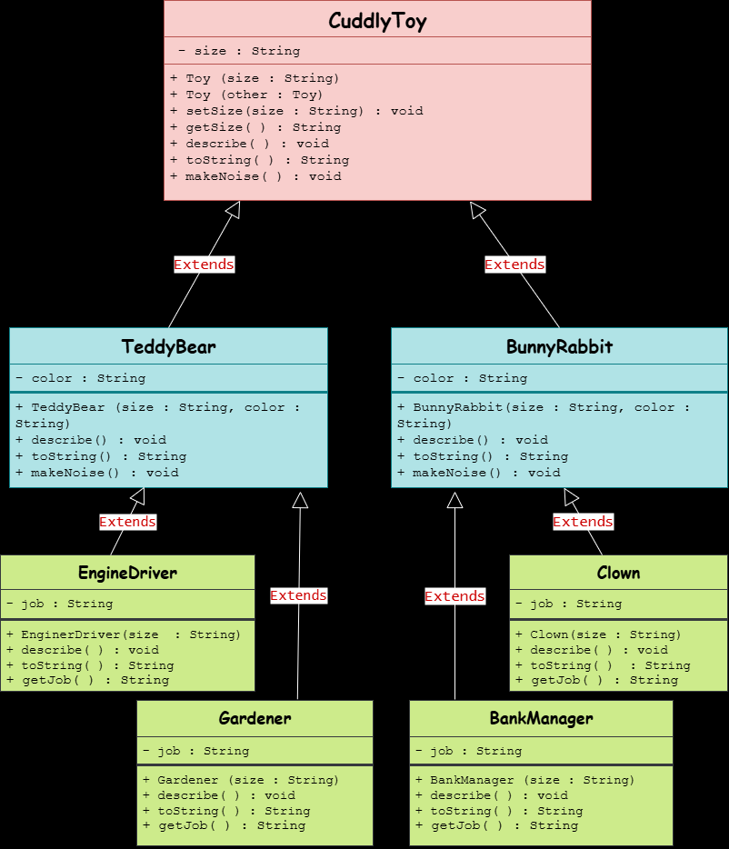
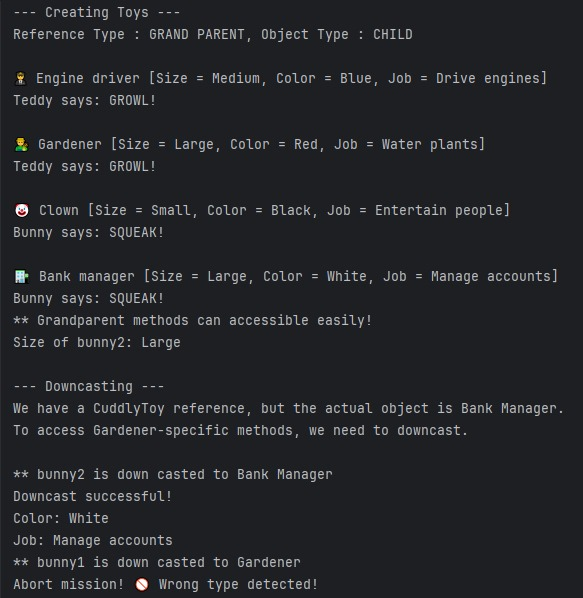

# **📄 Week 04 - Lab Task**

---

## Question

A toy manufacturer makes cuddly toys of four types in three sizes. Some toys are teddy bears, and some are bunny rabbits. 
Blue teddy bears are dressed as engine drivers. and red ones as gardeners. 
White bunnies are dressed as clowns, and black ones as bank managers. 
Teddies make a growling noise, whereas bunny rabbits squeak. All toys can say what job they do, what their colour is and what size they are.

Model the classes as described above in a hierarchy, the highest level of which should be the base class 'Cuddly Toy'. 
'There should be, an intermediate level of classes Teddy' and 'Bunny', and at the lowest level classes of 'engine driver, 'gardener', 'clown' and 'bank manager'. 
Instantiate objects of these classes dynamically via a base class pointer, setting the size of the toy via a parameter to the constructor. 
Use class attributes as appropriate. Demonstrate a method which wallows the toy to make a noise and tell us about itself.

---

## UML Diagram

---

## Concepts Used

- Inheritance 
- Reference Type vs Object Type
- Constructor chaining 
- Type casting
- ClassCastException (ERROR)

---

## Keywords Used

- extends 
- super
- this
- instanceof

---

## Code Location
You can view the complete source code for this task here:  
[➡ View Week-04 Code](./code)

---

## Program Output

---